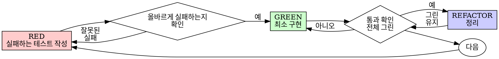

# 테스트 주도 개발 (TDD) — Python / unittest

## 개요

테스트를 먼저 작성한다. 실패하는 것을 확인한다. 통과시킬 최소한의 코드를 작성한다.

**핵심 원칙:** 테스트가 실패하는 것을 직접 보지 않았다면, 그 테스트가 올바른 것을 검증하는지 알 수 없다.

**규칙의 문구를 어기는 것은 규칙의 정신을 어기는 것이다.**

## 언제 사용하는가

**항상:**
- 새로운 기능
- 버그 수정
- 리팩터링
- 동작 변경

**예외 (사용자에게 확인 필요):**
- 일회성 프로토타입
- 자동 생성된 코드
- 빌드/설정 파일

"이번 한 번만 TDD를 건너뛰자"는 생각이 든다면? 멈춰라. 그것은 합리화다.

## 절대 법칙

```
실패하는 테스트 없이 프로덕션 코드를 작성하지 말 것
```

테스트보다 코드를 먼저 작성했는가? 삭제하라. 처음부터 다시 시작하라.

**예외 없음:**
- "참고용"으로 보관하지 마라
- 테스트를 작성하면서 그 코드를 "각색"하지 마라
- 그 코드를 보지 마라
- 삭제는 삭제다

테스트로부터 새롭게 구현하라. 끝.

## Red-Green-Refactor



### RED — 실패하는 테스트 작성

해야 할 일을 보여주는 최소한의 테스트 하나를 작성한다.

<Good>
```python
import unittest


class RetryHelperTest(unittest.TestCase):
    def test_retries_failed_operations_three_times(self):
        attempts = {"count": 0}

        def operation():
            attempts["count"] += 1
            if attempts["count"] < 3:
                raise RuntimeError("fail")
            return "success"

        result = retry(operation)

        self.assertEqual(result, "success")
        self.assertEqual(attempts["count"], 3)
```
명확한 이름, 실제 동작 검증, 한 가지만 테스트
</Good>

<Bad>
```python
class RetryTest(unittest.TestCase):
    def test_it_works(self):
        mock_op = unittest.mock.Mock(side_effect=[RuntimeError("e1"), RuntimeError("e2"), "success"])
        retry(mock_op)
        self.assertEqual(mock_op.call_count, 3)
```
모호한 이름, 실제 코드가 아닌 mock의 호출 횟수만 검증
</Bad>

**요구사항:**
- 하나의 동작
- 명확한 이름 (`test_<동작 설명>` 패턴)
- 실제 코드 사용 (불가피하지 않다면 `unittest.mock` 사용 금지)

### RED 검증 — 실패하는 것을 직접 본다

**필수. 절대 건너뛰지 말 것.**

```
python -m unittest tests.test_retry_helper.RetryHelperTest.test_retries_failed_operations_three_times -v
```

또는 특정 파일 전체:
```
python -m unittest tests.test_retry_helper -v
```

확인할 것:
- 테스트가 실패하는가 (`ImportError`/`SyntaxError`가 아닌)
- 실패 메시지가 예상한 그대로인가
- 기능이 없어서 실패하는가 (오타나 임포트 누락이 아닌)

**테스트가 통과한다고?** 이미 존재하는 동작을 테스트하고 있는 것이다. 테스트를 고쳐라.

**테스트가 `ImportError`/`SyntaxError`를 낸다고?** 오류를 고치고, 올바르게 실패할 때까지 다시 실행하라. import 실패는 RED가 아니다.

### GREEN — 최소 구현 코드

테스트를 통과시킬 가장 단순한 코드를 작성한다.

<Good>
```python
def retry(fn, attempts=3):
    for i in range(attempts):
        try:
            return fn()
        except Exception:
            if i == attempts - 1:
                raise
```
통과시킬 만큼만
</Good>

<Bad>
```python
def retry(fn, max_retries=3, backoff=None, on_retry=None, retry_predicate=None):
    ...  # 요청받지 않은 옵션들을 미리 다 구현
```
과도한 설계 — YAGNI
</Bad>

기능을 추가하지 마라, 다른 코드를 리팩터링하지 마라, 테스트가 요구하는 것 이상으로 "개선"하지 마라.

### GREEN 검증 — 통과하는 것을 직접 본다

**필수.**

```
python -m unittest tests.test_retry_helper.RetryHelperTest.test_retries_failed_operations_three_times -v
```

전체 테스트 회귀 확인:
```
python -m unittest discover tests
```

확인할 것:
- 테스트가 통과하는가
- 다른 테스트도 여전히 통과하는가
- 출력이 깨끗한가 (경고, 스킵된 테스트 없음)

**테스트가 실패한다고?** 코드를 고쳐라. 테스트가 아니다.

**다른 테스트가 깨졌다고?** 지금 고쳐라.

### REFACTOR — 정리

그린 상태에서만:
- 중복 제거
- 이름 개선
- 헬퍼 함수 추출
- 타입 힌트 정리
- 계층 간 책임 분리 (`repository.py` / `services.py` / `cli.py`)

테스트는 계속 그린 상태로 유지한다. 동작을 추가하지 않는다.

### 반복

다음 기능에 대한 다음 실패 테스트로 넘어간다.

## 좋은 테스트

| 품질 | 좋음 | 나쁨 |
|------|------|------|
| **최소** | 한 가지만. 이름에 `and`가 있나? 분리하라. | `test_validates_email_and_domain_and_whitespace` |
| **명확** | 이름이 동작을 설명한다 | `test1`, `test_basic` |
| **의도 표현** | 원하는 API를 보여준다 | 코드가 어떻게 동작해야 하는지 흐려놓는다 |

unittest 명명 규칙을 활용하라:
```python
class SampleRepositoryTest(unittest.TestCase):
    def test_raises_key_error_when_sample_missing(self):
        ...
```

## 순서가 중요한 이유

**"코드 작성 후 테스트로 검증하면 되지 않나"**

코드 작성 후 작성한 테스트는 즉시 통과한다. 즉시 통과하는 것은 아무것도 증명하지 않는다:
- 잘못된 것을 테스트했을 수 있다
- 동작이 아닌 구현 세부사항을 테스트했을 수 있다
- 잊어버린 엣지 케이스(빈 입력, 잘못된 상태 전이, 음수 재고)를 놓쳤을 수 있다
- 그 테스트가 실제로 버그를 잡는 것을 본 적이 없다

테스트 우선은 테스트가 실패하는 것을 직접 보게 만들어, 실제로 무언가를 검증한다는 사실을 증명한다.

**"엣지 케이스는 이미 콘솔에서 다 확인했다"**

수동 확인은 즉흥적이다. 모두 테스트했다고 생각하지만:
- 무엇을 확인했는지 기록이 없다
- 코드가 변경되면 다시 실행할 수 없다
- 압박 상황에서는 케이스를 잊기 쉽다

자동 테스트는 체계적이다. 매번 동일하게 실행된다.

**"X시간의 작업을 지우는 것은 낭비다"**

매몰비용 오류다. 그 시간은 이미 지나갔다. 지금의 선택지:
- 삭제하고 TDD로 재작성 (X시간 추가, 높은 신뢰도)
- 그대로 두고 사후 테스트 추가 (낮은 신뢰도)

"낭비"는 신뢰할 수 없는 코드를 그대로 두는 것이다.

**"TDD는 교조적이다, 실용주의는 적응하는 것이다"**

TDD가 곧 실용적이다:
- 커밋 전에 버그를 찾는다 (사후 디버깅보다 빠르다)
- 회귀를 방지한다 (테스트가 즉시 깨짐을 잡아낸다)
- 동작을 문서화한다 (테스트가 사용법을 보여준다)
- 리팩터링을 가능하게 한다 (자유롭게 변경, 테스트가 깨짐을 잡는다)

**"사후 테스트도 같은 목표를 달성한다 — 형식이 아닌 정신이다"**

아니다. 사후 테스트는 "이 코드가 무엇을 하는가?"에 답한다. 우선 테스트는 "이 코드가 무엇을 해야 하는가?"에 답한다.

사후 테스트는 당신의 구현에 편향된다. 요구사항이 아닌 만든 것을 테스트한다. 발견한 엣지 케이스가 아닌 기억나는 엣지 케이스를 검증한다.

## 흔한 합리화

| 변명 | 현실 |
|------|------|
| "테스트하기엔 너무 단순하다" | 단순한 코드도 깨진다. 테스트는 30초면 된다. |
| "나중에 테스트하겠다" | 즉시 통과하는 테스트는 아무것도 증명하지 않는다. |
| "사후 테스트도 같은 목표를 달성한다" | 사후 = "이 코드가 무엇을 하는가?", 우선 = "무엇을 해야 하는가?" |
| "이미 콘솔로 확인했다" | 즉흥적 ≠ 체계적. 기록이 없고, 다시 실행할 수 없다. |
| "X시간을 지우는 것은 낭비" | 매몰비용 오류. 검증되지 않은 코드를 두는 것이 기술 부채다. |
| "참고용으로 두고 테스트 먼저 작성한다" | 그것을 각색하게 된다. 그건 사후 테스트다. 삭제는 삭제다. |
| "먼저 탐색해야 한다" | 좋다. 탐색 코드는 버리고, TDD로 시작하라. |
| "테스트하기 어렵다 = 설계가 불명확하다" | 테스트의 말을 들어라. 테스트하기 어려우면 사용하기도 어렵다. |
| "TDD는 나를 느리게 한다" | TDD는 디버깅보다 빠르다. 실용적 = 테스트 우선. |
| "기존 코드에 테스트가 없다" | 당신이 그것을 개선하는 중이다. 기존 코드에도 테스트를 추가하라. |

## 위험 신호 — 멈추고 처음부터 다시 시작

- 테스트보다 먼저 작성된 코드
- 구현 후 작성된 테스트
- 테스트가 즉시 통과
- 테스트가 왜 실패했는지 설명할 수 없음
- 테스트를 "나중에" 추가
- "이번 한 번만"이라는 합리화
- "이미 콘솔로 확인했다"
- "사후 테스트도 같은 목적을 달성한다"
- "형식이 아니라 정신이다"
- "참고용으로 두자" 또는 "기존 코드를 각색하자"
- "이미 X시간 썼는데 지우는 건 낭비다"
- "TDD는 교조적이다, 나는 실용적이다"
- "이건 다르다, 왜냐하면…"

**이 모든 것의 의미: 코드를 삭제하라. TDD로 처음부터 다시 시작하라.**

## 예시: 버그 수정

**버그:** 재고보다 많은 수량으로 주문이 승인됨

**RED**
```python
class OrderServiceTest(unittest.TestCase):
    def test_approve_with_insufficient_stock_raises(self):
        self.sample_repo.create(Sample("S1", "Wafer-A", 10.0, 0.95, stock=5))
        self.order_repo.create(Order("O1", "S1", "ACME", quantity=10, status="RECEIVED", created_at="..."))

        with self.assertRaises(ValueError):
            self.service.approve("O1")
```

**RED 검증**
```
$ python -m unittest tests.test_services.OrderServiceTest.test_approve_with_insufficient_stock_raises -v
FAIL: test_approve_with_insufficient_stock_raises
ValueError not raised
```

**GREEN**
```python
def approve(self, order_id):
    order = self.order_repo.get(order_id)
    sample = self.sample_repo.get(order.sample_id)
    if sample.stock < order.quantity:
        raise ValueError(f"Insufficient stock for sample {sample.sample_id}")
    self._transition(order_id, APPROVED)
```

**GREEN 검증**
```
$ python -m unittest tests.test_services.OrderServiceTest.test_approve_with_insufficient_stock_raises -v
OK
```

**REFACTOR**
재고 검증이 다른 전이(예: 출고)에서도 필요해지면 별도 헬퍼로 추출한다.

## unittest.mock 사용 시 (불가피한 경우)

외부 의존성(파일 시스템, 네트워크, 현재 시각)이 있을 때만 mock을 사용한다.

```python
from unittest.mock import patch


class TokenTest(unittest.TestCase):
    @patch("app.token.datetime")
    def test_expires_after_one_hour(self, mock_datetime):
        ...
```

mock으로 테스트를 도배하지 마라. 의존성이 자연스럽게 주입되도록 설계가 안 되어 있다면, mock이 아니라 설계를 고쳐라. (예: `OrderService`가 `OrderRepository`/`SampleRepository`를 생성자로 주입받는 현재 구조가 이런 이유다.)

## 실용 명령어

```
# 전체 테스트
python -m unittest discover tests

# 특정 파일
python -m unittest tests.test_services -v

# 특정 클래스/메서드
python -m unittest tests.test_services.OrderServiceTest.test_ship_without_production_raises -v
```

## 검증 체크리스트

작업을 완료로 표시하기 전에:

- [ ] 모든 새 함수/메서드/클래스에 테스트가 있다
- [ ] 각 테스트가 구현 전에 실패하는 것을 직접 보았다
- [ ] 각 테스트가 예상한 이유로 실패했다 (오타/임포트 누락이 아닌 기능 부재)
- [ ] 각 테스트를 통과시킬 최소 코드를 작성했다
- [ ] 모든 테스트가 통과한다 (`python -m unittest discover tests`)
- [ ] 출력이 깨끗하다 (경고, 스킵 없음)
- [ ] 테스트가 실제 코드를 사용한다 (mock은 불가피한 경우만)
- [ ] 엣지 케이스, 오류 경로(잘못된 상태 전이, 재고 부족 등)가 다뤄졌다

모두 체크할 수 없다면? TDD를 건너뛴 것이다. 처음부터 다시 시작하라.

## 막힐 때

| 문제 | 해결 |
|------|------|
| 어떻게 테스트할지 모르겠다 | 원하는 API를 먼저 적어보라. `assert*`부터 작성하라. 사용자에게 물어보라. |
| 테스트가 너무 복잡하다 | 설계가 너무 복잡하다. 인터페이스를 단순화하라. |
| 모든 것을 mock해야 한다 | 코드가 너무 결합되어 있다. 의존성 주입을 사용하라. |
| 테스트 셋업이 너무 크다 | `setUp`으로 공통 픽스처를 만들거나 헬퍼를 추출하라. |
| 전역 상태 때문에 테스트 어려움 | 전역 상태를 인스턴스 멤버로 옮기고 주입하라. |

## 디버깅과의 통합

버그를 발견했나? 이를 재현하는 실패 테스트를 작성하라. TDD 사이클을 따른다. 테스트가 수정을 증명하고 회귀를 방지한다.

테스트 없이 버그를 고치지 마라.

## 테스트 안티패턴

mock이나 테스트 유틸리티를 추가할 때, 흔한 함정을 피하기 위해 점검하라:
- 실제 동작이 아닌 mock의 동작을 테스트하기
- 의존성을 이해하지 않고 mock하기
- 호출 횟수만 검증하고 결과는 검증하지 않기
- private 속성을 직접 건드려서 캡슐화 깨기

unittest에서 추가로 유용한 것들:
- `setUp` / `tearDown` — 공통 셋업이 필요한 픽스처
- `subTest` — 같은 동작을 여러 입력으로 검증
- `assertRaises` — 예외 동작 검증
- in-memory sqlite(`sqlite3.connect(":memory:")`) — DB 관련 테스트 격리

## 최종 규칙

```
프로덕션 코드 → 먼저 실패한 테스트가 존재한다
그렇지 않으면 → TDD가 아니다
```

사용자의 명시적인 허락 없이는 예외 없음.
